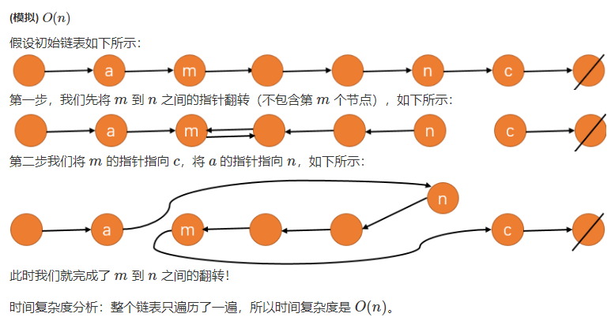
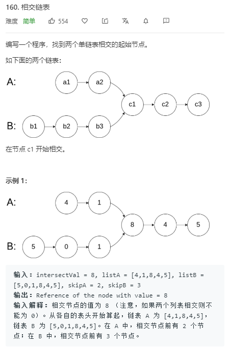
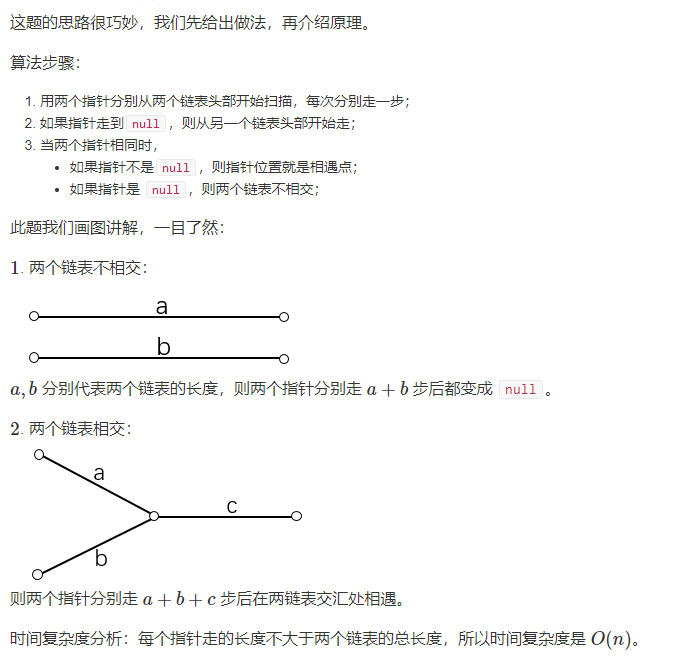
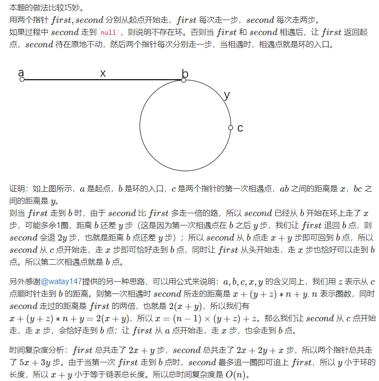
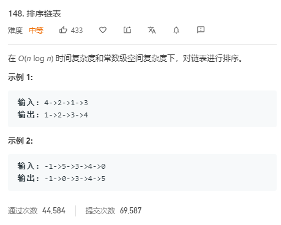

# *Week1-链表专题*
## LeetCode 19. 删除链表的倒数第N个节点


```c++
/**双指针
	1.建立虚拟头结点
	2.first向后走n步
    3.first、second同时向后走，当first走到末尾时停止。
/**
 * Definition for singly-linked list.
 * struct ListNode {
 *     int val;
 *     ListNode *next;
 *     ListNode(int x) : val(x), next(NULL) {}
 * };
 */
class Solution {
public:
    ListNode* removeNthFromEnd(ListNode* head, int n) {
        ListNode *dummy = new ListNode(-1);//创建虚拟头结点
        dummy->next = head;//虚拟头结点指向head节点
        ListNode *first = dummy, *second = dummy;//双指针
        for (int i = 0; i < n; i ++ ) first = first->next;
        while (first -> next)
        {
            first = first->next;
            second = second->next;
        }
        second->next = second->next->next;
        return dummy->next;//虚拟头结点的下一个节点，不能是head！！！
    }
};
```
## LeetCode 237. 删除链表中的节点


```c++
/*直接指向下一个节点
/**
 * Definition for singly-linked list.
 * struct ListNode {
 *     int val;
 *     ListNode *next;
 *     ListNode(int x) : val(x), next(NULL) {}
 * };
 */
class Solution {
public:
    void deleteNode(ListNode* node) {
        node->val = node->next->val;
        node->next = node->next->next;
        //还可以写成*(node) = *(node->next);
        //C++的特性，*(node)取node结构体的指针和地址！！！
    }
};
```
## LeetCode 83.删除排序链表中的重复元素


```c++
/*相同的都排在一起，只取第一个
1.下一个点和当前点相同，则删掉下一点
2.下一个点和当前点不相同，则移动指针
/**
 * Definition for singly-linked list.
 * struct ListNode {
 *     int val;
 *     ListNode *next;
 *     ListNode(int x) : val(x), next(NULL) {}
 * };
 */
class Solution {
public:
    ListNode* deleteDuplicates(ListNode* head) {
        if (!head) return NULL;
        ListNode *first, *second;
        first = second = head;
        while (first)
        {
            if (first->val != second->val)
            {
                second->next = first;
                second = first;
            }
            first = first->next;
        }
        second->next = NULL;
        return head;
    }
};

简洁版：
class Solution {
public:
    ListNode* deleteDuplicates(ListNode* head) {
		auto cur = head;
        while(cur){
            if(cur->next && cur->next->val == cur->val)
                cur->next = cur->next->next;
            else cur = cur->next;
        }
        return head;
    }
};
```
## LeetCode 206. 反转链表


```c++
/*指针变方向，递归
双指针，
c = b->next
b ->next = a;
a = b,b = c;
b为空时a为头结点
链表形式：a--b--c....
/**
 * Definition for singly-linked list.
 * struct ListNode {
 *     int val;
 *     ListNode *next;
 *     ListNode(int x) : val(x), next(NULL) {}
 * };
 */
class Solution {
public:
    ListNode* reverseList(ListNode* head) {
        if (!head) return NULL;
        if (!head->next) return head;
        ListNode *p = reverseList(head->next);
        head->next->next = head;
        head->next = NULL;
        return p;
    }
};
***********************************************************************
class Solution {
public:
    ListNode* reverseList(ListNode* head) {
		if(!head) return NULL;
        
        auto a = head,b = head->next;
        while(b)
        {
            auto c = b->next;
            b->next = a;
            a = b,b = c;
		}
        head->next = NULL;
        return a;
    }
};
```

## LeetCode 92. 反转链表 II



```c++
/*先求三个点的位置
/**
 * Definition for singly-linked list.
 * struct ListNode {
 *     int val;
 *     ListNode *next;
 *     ListNode(int x) : val(x), next(NULL) {}
 * };
 */
class Solution {
public:
    ListNode* reverseBetween(ListNode* head, int m, int n) {
        if (m == n) return head;//不用操作
        ListNode *dummy = new ListNode(-1);
        dummy->next = head;
        ListNode *b = dummy;
        for (int i = 0; i < m - 1; i ++ ) b = b->next;
        ListNode *a = b;
        b = b->next;
        ListNode *c = b->next;
        for (int i = 0; i < n - m; i ++ )
        {
            ListNode *t = c->next;
            c->next = b;
            b = c, c = t;
        }
        ListNode *mp = a->next;
        ListNode *np = b;
        a->next = np, mp->next = c;
        return dummy->next;
    }
};
```
## LeetCode 61. 旋转链表


```c++
/*把最后k个移动到开头
1.k %= n 保证k在0 ~ n之间！！！
2.双指针，first指针从头往后走K步
3.first、second同时往后走，当first走到结尾时停止
4.移动指针
/**
 * Definition for singly-linked list.
 * struct ListNode {
 *     int val;
 *     ListNode *next;
 *     ListNode(int x) : val(x), next(NULL) {}
 * };
 */
class Solution {
public:
    ListNode* rotateRight(ListNode* head, int k) {
        if (!head) return head;

        int n = 0;
        ListNode *p = head;
        while (p)
        {
            n ++ ;
            p = p->next;
        }

        k %= n;
        if (!k) return head;


        ListNode *first = head;
        while (k -- && first) first = first->next;
        ListNode *second = head;
        while (first->next)
        {
            first = first->next;
            second = second->next;
        }
        //移动指针
        first->next = head;
        head = second->next;
        second->next = NULL;
        return head;
    }
};

***********************简洁版**************************
 /**
 * Definition for singly-linked list.
 * struct ListNode {
 *     int val;
 *     ListNode *next;
 *     ListNode(int x) : val(x), next(NULL) {}
 * };
 */
class Solution {
public:
    ListNode* rotateRight(ListNode* head, int k) {
        if(!head) return NULL;

        int n = 0;
        for(auto p = head;p;p = p->next) n ++;

        k %= n;
        auto first = head,second = head;
        while(k --) first = first->next;
        while(first->next)
        {
            first = first->next;
            second = second->next;
        }
        first->next = head;
        head = second->next;
        second->next = NULL;

        return head;
    }
};
```

## LeetCode 24.两两交换链表中的节点


```c++
/*相邻两点之间交换
1.建立虚拟头结点
2.交换指针，移动指针
p->next = b;
a->next = b->next;
b->next = a;
p = a;
/**
 * Definition for singly-linked list.
 * struct ListNode {
 *     int val;
 *     ListNode *next;
 *     ListNode(int x) : val(x), next(NULL) {}
 * };
 */
class Solution {
public:
    ListNode* swapPairs(ListNode* head) {
        auto dummy = new ListNode(-1);
        dummy->next = head;

        for(auto p = dummy;p && p->next && p->next->next;p = p->next)
        {
            auto a = p->next,b = a->next;
            p->next = b;
            a->next = b->next;
            b->next = a;
            p = a;
        }
        return dummy->next;
    }
};
```

## LeetCode 160. 相交链表 !!!





```c++
/*p,q都走完a+b+c之后一定相遇！！！妙啊~
/**
 * Definition for singly-linked list.
 * struct ListNode {
 *     int val;
 *     ListNode *next;
 *     ListNode(int x) : val(x), next(NULL) {}
 * };
 */
class Solution {
public:
    ListNode *getIntersectionNode(ListNode *headA, ListNode *headB) {
        ListNode *p = headA, *q = headB;
        while (p != q)
        {
            if (p) p = p->next;
            else p = headB;
            if (q) q = q->next;
            else q = headA;
        }
        return p;
    }
};
```

## LeetCode 142. 环形链表 II




```c++
/*
1.快慢指针，快的每次走一步，慢的每次走两步。
2.在环中每走y步两指针距离就少一
3.相遇后把慢的放到开头
4.快慢每次都走一步，当再次相遇时就是环的入口
/**
 * Definition for singly-linked list.
 * struct ListNode {
 *     int val;
 *     ListNode *next;
 *     ListNode(int x) : val(x), next(NULL) {}
 * };
 */
class Solution {
public:
    ListNode *detectCycle(ListNode *head) {
        if (!head || !head->next) return 0;
        ListNode *first = head, *second = head;

        while (first && second)
        {
            first = first->next;
            second = second->next;
            if (second) second = second->next;
            else return 0;

            if (first == second)
            {
                first = head;
                while (first != second)
                {
                    first = first->next;
                    second = second->next;
                }
                return first;
            }
        }

        return 0;
    }
};

*******************************************************************
/**
 * Definition for singly-linked list.
 * struct ListNode {
 *     int val;
 *     ListNode *next;
 *     ListNode(int x) : val(x), next(NULL) {}
 * };
 */
class Solution {
public:
    ListNode *detectCycle(ListNode *head) {
        auto fast = head,slow = head;
        while(fast)
        {
            fast = fast->next;
            slow = slow->next;
            if(fast) fast = fast->next;
            else break;

            if(fast == slow)
            {
                fast = head;
                while(slow != fast)
                {
                    fast = fast->next;
                    slow = slow->next;
                }
                return slow;
            }
        }
        return NULL;
    }
};
```

## LeetCode 148. 排序链表




```c++
/*不能用递归，用归并排序
空间复杂度O(1)
/**
 * Definition for singly-linked list.
 * struct ListNode {
 *     int val;
 *     ListNode *next;
 *     ListNode(int x) : val(x), next(NULL) {}
 * };
 */
class Solution {
public:
    ListNode* sortList(ListNode* head) {
        int n = 0;
        for (ListNode *p = head; p; p = p->next) n ++ ;

        ListNode *dummy = new ListNode(-1);
        dummy->next = head;
        for (int i = 1; i < n; i *= 2)
        {
            ListNode *begin = dummy;
            for (int j = 0; j + i < n; j += i * 2)
            {
                ListNode *first = begin->next, *second = first;
                for (int k = 0; k < i; k ++ )
                    second = second->next;
                int f = 0, s = 0;
                while (f < i && s < i && second)
                    if (first->val < second->val)
                    {
                        begin = begin->next = first;
                        first = first->next;
                        f ++ ;
                    }
                    else
                    {
                        begin = begin->next = second;
                        second = second->next;
                        s ++ ;
                    }

                while (f < i)
                {
                    begin = begin->next = first;
                    first = first->next;
                    f ++ ;
                }
                while (s < i && second)
                {
                    begin = begin->next = second;
                    second = second->next;
                    s ++ ;
                }

                begin->next = second;
            }
        }

        return dummy->next;
    }
};
```

