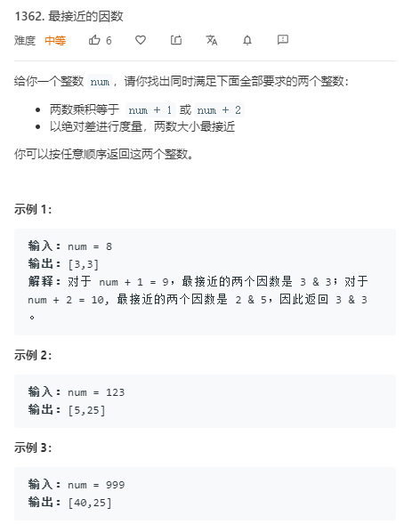

## LeetCode 1360. 日期之间隔几天


```c++
class Solution {
public:
    int daysBetweenDates(string date1, string date2) {
        return abs(get(date1) - get(date2));
    }
    bool isLeap(int year){
        return year % 100 && year % 4 == 0 || year % 400 == 0;
    }
        
    int MonthDays[13] = {0, 31, 28, 31, 30, 31, 30, 31, 31, 30, 31, 30, 31};

    int get(string date)
    {
        int year, month, day;
        sscanf(date.c_str(), "%d-%d-%d", &year, &month, &day);//读取字符串c_str()读取第一个字符地址。

        int days = 0;
        for(int i = 1971;i < year;i ++) days += 365 + isLeap(i);
        for(int i = 0;i < month;i ++)
        {
            if(i == 2) days += 28 + isLeap(year);
            else days += MonthDays[i];
        }

        return days + day;
    }
};
```
## LeetCode 1361. 验证二叉树


```c++
/*搜索过程中1.不能有重复的点。2.所有点都被找到。*/
class Solution {
public:
    bool validateBinaryTreeNodes(int n, vector<int>& leftChild, vector<int>& rightChild) {
        vector<int> d(n);//入度数。
        for (int i = 0; i < n; i ++ ) {
            if (leftChild[i] != -1) d[leftChild[i]] ++ ;
            if (rightChild[i] != -1) d[rightChild[i]] ++ ;
        }//计算所有入度

        int root = 0;
        while (root < n && d[root]) root ++ ;//寻找根节点

        if (root == n) return false;//没有根节点。

        vector<bool> st(n);//是否被遍历过
        st[root] = true;
        queue<int> q;//宽搜
        q.push(root);

        while (q.size()) {
            int t = q.front();
            q.pop();

            int sons[] = {leftChild[t], rightChild[t]};//遍历左右儿子
            for (auto s : sons) {
                if (s != -1) {
                    if (st[s]) return false;//是否重复遍历了
                    st[s] = true;
                    q.push(s);
                }
            }
        }

        for (auto state : st)//是否所有点都被遍历了
            if (!state)
                return false;

        return true;
    }
};
```
## LeetCode 1362. 最接近的因数



```c++
class Solution {
public:
    vector<int> closestDivisors(int num) {
        for (int i = sqrt(num + 2); i; i -- ) {
            if ((num + 1) % i == 0) return {i, (num + 1) / i};
            if ((num + 2) % i == 0) return {i, (num + 2) / i};
        }
        return {};
    }
};
```
