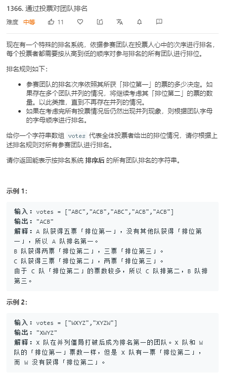

## LeetCode 1365. How Many Numbers Are Smaller Than the Current Number


```c++
class Solution {
public:
    vector<int> smallerNumbersThanCurrent(vector<int>& nums) {
        vector<int> res(nums.size());
        for(int i = 0;i < nums.size();i ++)
        {
            for(int x : nums)
            {
                if(nums[i] > x)
                    res[i] ++;
            }
        }
        return res;
    }

};
```
## LeetCode 1366. Rank Teams by Votes  !!!



```c++
class Solution {
public:
    string rankTeams(vector<string>& votes) {
        int n = votes[0].size();
        vector<vector<int>> ranks(26, vector<int>(n + 1));//二维数组，每个同学在各种排名下的次数。ranks[i][n]   ranks[选手][排名]

        for (int i = 0; i < 26; i ++ ) {
            ranks[i][n] = -i;
        }

        for (auto &vote : votes)
            for (int i = 0; i < n; i ++ )
                ranks[vote[i] - 'A'][i] ++ ;

        sort(ranks.begin(), ranks.end(), greater<vector<int>>());//从小到大排序。

        string res;
        for (int i = 0; i < n; i ++ ) res += -ranks[i][n] + 'A';
        return res;
    }
};
```
## LeetCode 1367. Linked List in Binary Tree


```c++
/**
 * Definition for singly-linked list.
 * struct ListNode {
 *     int val;
 *     ListNode *next;
 *     ListNode(int x) : val(x), next(NULL) {}
 * };
 */
/**
 * Definition for a binary tree node.
 * struct TreeNode {
 *     int val;
 *     TreeNode *left;
 *     TreeNode *right;
 *     TreeNode(int x) : val(x), left(NULL), right(NULL) {}
 * };
 */
//枚举起点，然后往下继续找。
class Solution {
public:
    bool isSubPath(ListNode* head, TreeNode* root) {
        if (dfs(head, root)) return true;

        if (!root) return false;
        return isSubPath(head, root->left) || isSubPath(head, root->right);  // 枚举起点
    }

    bool dfs(ListNode* cur, TreeNode* root) {  // 起点已经固定，匹配的过程，从当前点匹配能不能成功
        if (!cur) return true;//链表已经匹配完。
        if (!root) return false;//匹配不到。

        if (cur->val != root->val) return false;

        return dfs(cur->next, root->left) || dfs(cur->next, root->right);
    }
};
```